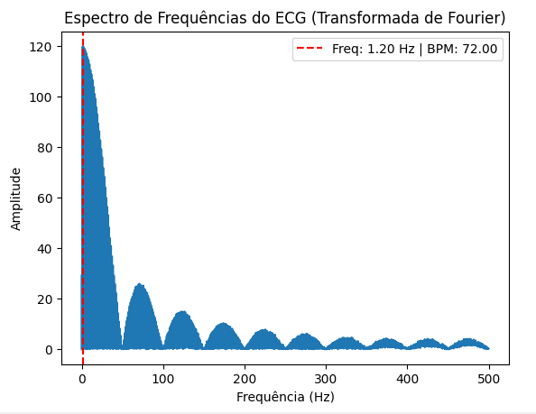
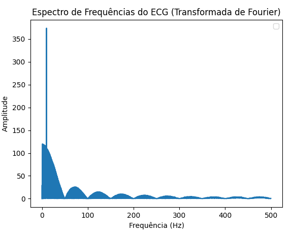

# Análise de Sinais de ECG usando Transformada de Fourier

## Descrição do projeto 📄

Este projeto simula sinais de eletrocardiograma (ECG) e utiliza a Transformada de Fourier (TF) para analisar suas frequências. A Transformada de Fourier é uma ferramenta matemática fundamental que transforma um sinal do domínio do tempo para o domínio da frequência, permitindo identificar a composição espectral do sinal.

## Objetivo 🎯

O objetivo principal deste projeto é demonstrar como a Transformada de Fourier pode ser aplicada na análise de sinais de ECG para identificar características importantes da atividade elétrica do coração. Em particular, o projeto simula um sinal ECG normal e um sinal ECG com uma frequência intrusa, que pode representar um problema cardíaco.

# Funcionalidades ✨

- Cálculo da Transformada de Fourier para identificar as frequências presentes nos sinais.

- Visualização gráfica dos sinais ECG no domínio do tempo e suas representações no domínio da frequência.

- Destaque da frequência dominante e sua conversão para batimentos por minuto (BPM).

## Como Funciona ⚙️

- Geração do Sinal de ECG: O projeto contém funções para gerar sinais de ECG, que incluem as ondas P, QRS e T. Uma função adicional gera um sinal com uma frequência intrusa, simulando uma condição anormal do coração. Ambos os sinais foram gerados por inteligência artificial para fins de simulação.

  - Para escolher qual sinal gerar (normal ou com problema), basta descomentar a chamada da função correspondente e comentar a que não será utilizada. Veja o exemplo abaixo:

  ```python
  # Gerar o sinal de ECG normal ou sinal com problema
  #ECG = gerarSinalECG(fs=fs, duration=duration, heart_rate=heart_rate)  # Sinal normal
  ECG = gerarSinalECGComProblema(fs=fs, duration=duration, heart_rate=heart_rate, intrusao_freq=10.0)  # Sinal com problema
  ```

- Cálculo da Transformada de Fourier: A Transformada de Fourier é aplicada ao sinal de ECG, e a magnitude da TF é analisada para identificar a frequência dominante.

- Visualização: O projeto plota gráficos dos sinais no domínio do tempo e das frequências, incluindo a frequência dominante marcada.

## Bibliotecas Utilizadas 📚

- numpy

- matplotlib

## Graficos 📊

Nesta seção, serão apresentados os gráficos gerados durante a execução do projeto, juntamente com uma breve explicação de cada um.
aqui eu quero adicionar as imagens dos graficos e explicação sobre cada

### 1. Sinal de ECG Normal (Amostras)

**Descrição:** Este gráfico representa o sinal de ECG normal no domínio das amostras. As ondas P, QRS e T estão claramente visíveis, indicando uma atividade elétrica saudável do coração.

.png>)

### 2. Sinal de ECG Normal (Tempo)

**Descrição:** Este gráfico mostra o sinal de ECG normal ao longo do tempo, permitindo uma visualização detalhada da evolução da atividade cardíaca.

.png>)

### 3. Espectro de Frequências do ECG Normal (Transformada de Fourier)

**Descrição:** Este gráfico apresenta a Transformada de Fourier do sinal de ECG normal, mostrando as frequências presentes. A linha vertical vermelha indica a frequência dominante, que é um parâmetro importante na análise de ECG.



### 4. Sinal de ECG Anormal (Amostras)

**Descrição:** Este gráfico representa o sinal de ECG com uma frequência intrusa, simulando uma condição anormal do coração.

.png>)

### 5. Sinal de ECG Anormal (Tempo)

**Descrição:** Este gráfico mostra o sinal de ECG com frequência intrusa ao longo do tempo. A distorção no padrão normal é evidente, indicando uma potencial anomalia cardíaca.

.png>)

### 6. Espectro de Frequências do ECG Normal (Transformada de Fourier)

**Descrição:** Este gráfico apresenta a Transformada de Fourier do sinal de ECG com frequência intrusa. A frequência adicional é visível ao se tornar uma nova frequência dominante, que pode ser indicativa de um problema cardíaco.



## Conclusão 📝

A Transformada de Fourier é uma ferramenta poderosa na análise de sinais biomédicos. Este projeto demonstra como ela pode ser utilizada para entender a atividade elétrica do coração através da análise de sinais de ECG gerados por inteligência artificial. Com a transformação, é possível identificar anomalias e padrões que podem ser cruciais para diagnósticos médicos.
